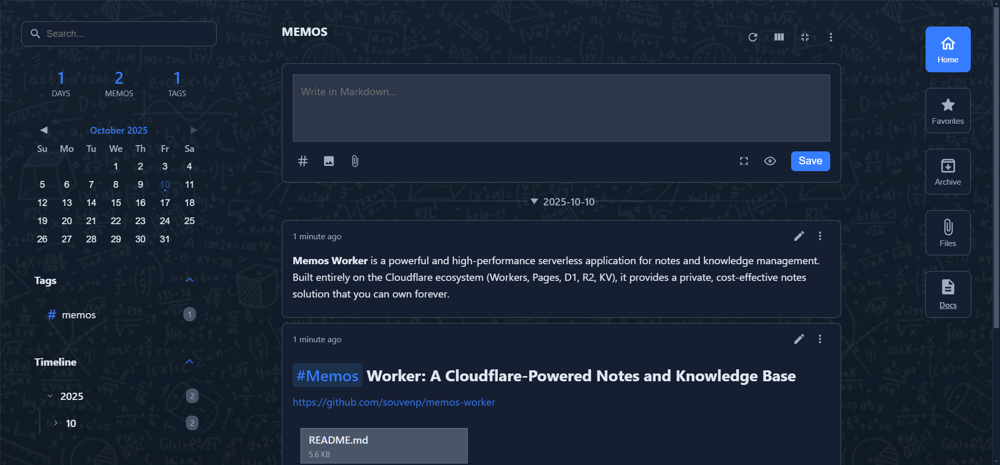
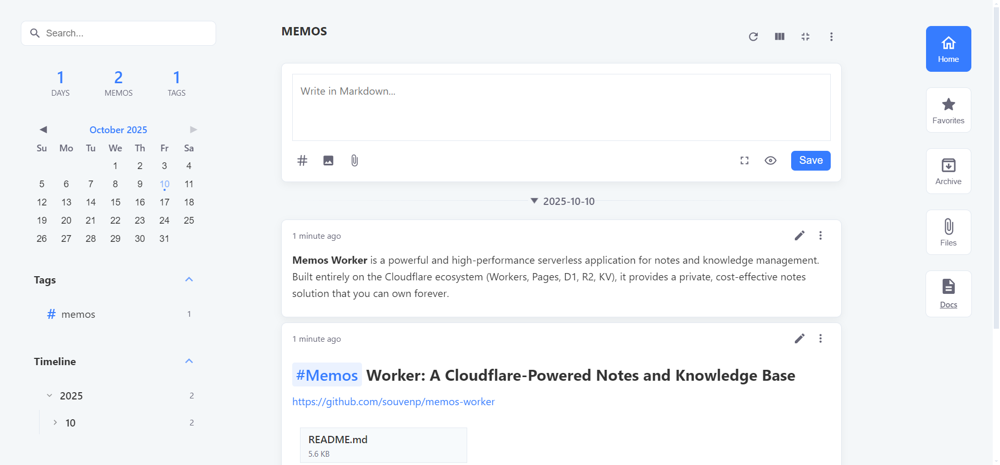
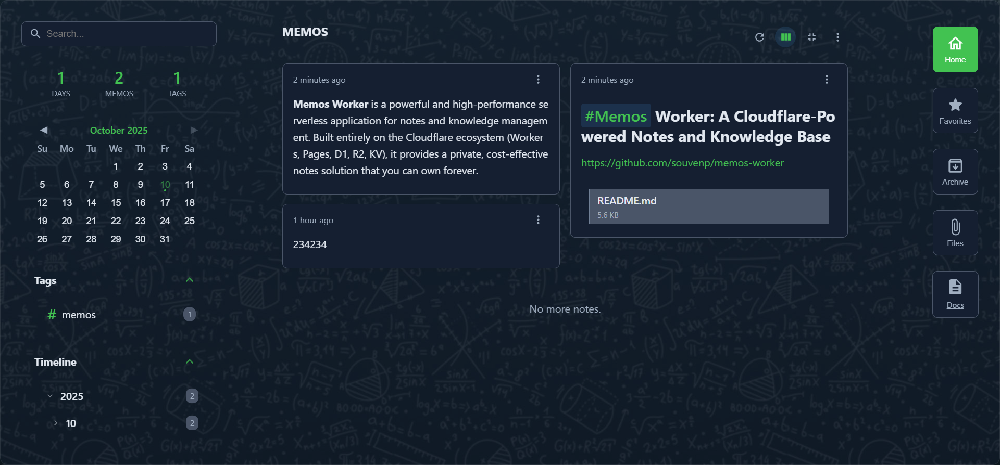
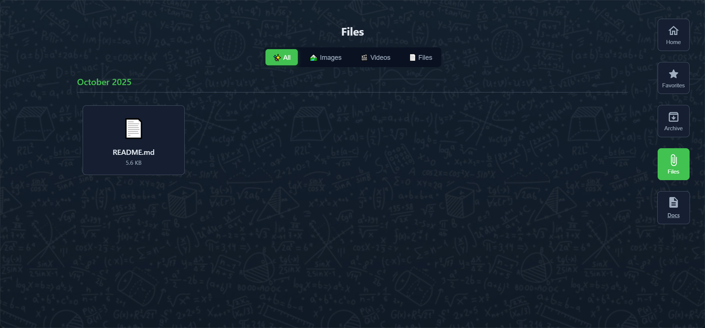

[English](./README.md)

# Memos Worker: 由 Cloudflare 驱动的笔记与知识库






**Memos Worker** 是一个功能强大、性能卓越的无服务器笔记和知识库应用。它完全构建在 Cloudflare 的生态系统之上（Workers, Pages, D1, R2, KV），为你提供一个可以永久拥有、近乎零成本的私有化笔记解决方案。

## ✨ 功能特点

-   **✍️ Markdown 全功能支持**: 支持实时预览、分栏编辑，并能从富文本智能粘贴为 Markdown。
-   **🗂️ 文件与附件**: 支持拖拽或粘贴上传图片（可存至 R2 或 Imgur）及各类文件附件。
-   **🔗 公开分享**: 可以为笔记中的文件生成唯一的公开访问链接。
-   **🤖 Telegram 集成**: 通过 Telegram Bot 随时随地记录文本、图片、视频和文件。
-   **📚 强大组织能力**: 自动标签、全文搜索、时间线、日历和活动热力图。
-   **📃 知识库 (Docs)**: 独立的树状文档中心，适合构建结构化的知识体系。
-   **🎨 高度可定制**: 支持浅色/深色主题、自定义主色调、背景图片、玻璃模糊效果及布局调整。
-   **🚀 极致性能与低成本**: 基于 Cloudflare 全球网络，响应迅速，在免费套餐额度内几乎零成本运行。
-   **🔐 数据自主**: 所有数据均存储在你自己的 Cloudflare 账户中。

## 🚀 部署指南

### 第 1 步: Fork本项目并创建 Cloudflare 资源

1.  **Fork 本项目**到你自己的 GitHub 账户。
2. 创建 Cloudflare 资源

你需要在 Cloudflare Dashboard 中手动创建好项目所需的 D1 数据库、R2 存储桶和 KV 命名空间。

| 资源类型        | 推荐名称          | 绑定变量名        |
| --------------- | ----------------- | ----------------- |
| **D1 数据库**   | `notes-db`        | `DB`              |
| **KV 命名空间** | `notes-kv`        | `NOTES_KV`        |
| **R2 存储桶**   | `notes-r2-bucket` | `NOTES_R2_BUCKET` |

1.  **创建 D1 数据库 (`notes-db`)**:
	-   进入 **Workers & Pages** -> **D1** -> **Create database**。
	-   **重要**: 创建后，进入数据库控制台，将项目根目录下的 `schema.sql` 文件内容完整复制进去并执行。
    - **重要**: 记下database_id和database_name，写入 `wrangler.toml` 文件D1部分。

2.  **创建 KV 命名空间 (`notes-kv`)**:
	-   进入 **Workers & Pages** -> **KV** -> **Create a namespace**。
    - **重要**: 记下id，写入 `wrangler.toml` 文件KV部分。

3.  **创建 R2 存储桶 (`notes-r2-bucket`)**:
	-   进入 **R2** -> **Create bucket**。
    - **重要**: 记下bucket_name，写入 `wrangler.toml` 文件R2部分。

### 第 2 步: 部署到 Cloudflare Workers

1.  进入 Cloudflare Dashboard -> **Workers & Pages** -> **Create application** -> **选择Workers** -> **连接刚才创建的Git库**。
2.  选择你 Fork 的仓库，然后直接点击 **Save and Deploy**。

### 第 3 步: 配置环境变量

部署完成后，进入你创建的 Worker 项目进行配置。

1.  进入项目 -> **Settings**，进入 **Environment Variables**，添加以下变量：

	| Variable Name           | Description                          |
    | ----------------------- | ------------------------------------ |
	| `USERNAME`              | 你的登录用户名                       |
	| `PASSWORD`              | 你的登录密码                         |
	| `TELEGRAM_BOT_TOKEN`    | (可选) Telegram 机器人的 Token       |
	| `TELEGRAM_WEBHOOK_SECRET` | (可选) 一个随机长字符串用于 Webhook 验证 |
	| `AUTHORIZED_TELEGRAM_IDS` | (可选) 授权使用机器人的 Telegram 用户 ID |

2.  重新部署，让所有配置生效。

## 🔧 项目开发 (Wrangler)

### 1. 本地开发 (模拟环境)

**初始化本地数据库**:
```bash
npx wrangler d1 execute memos-db --local --file=./schema.sql
```

**启动开发服务器**:
```bash
npx wrangler dev
```

### 2. 本地开发 (连接云端真实资源)

此模式连接到你在 Cloudflare 上创建的真实资源，适合调试数据逻辑。

1.  **配置 `wrangler.toml`**: 将你在 Cloudflare Dashboard 中创建的资源 ID 填入此文件。
	```toml
	# wrangler.toml
	[[d1_databases]]
	binding = "DB"
	database_name = "notes-db"
	database_id = "YOUR_D1_DATABASE_ID" # 替换

	[[kv_namespaces]]
	binding = "NOTES_KV"
	id = "YOUR_KV_NAMESPACE_ID" # 替换

	[[r2_buckets]]
	binding = "NOTES_R2_BUCKET"
	bucket_name = "notes-r2-bucket"
	```
2.  **创建 `.dev.vars` 文件**: 在项目根目录创建此文件并填入你的密钥。
	```ini
	# .dev.vars (此文件不会被提交到 Git)
	USERNAME="dev_user"
	PASSWORD="dev_password"
	```
3.  **启动远程开发服务器**:
	```bash
	npx wrangler dev --remote
	```
